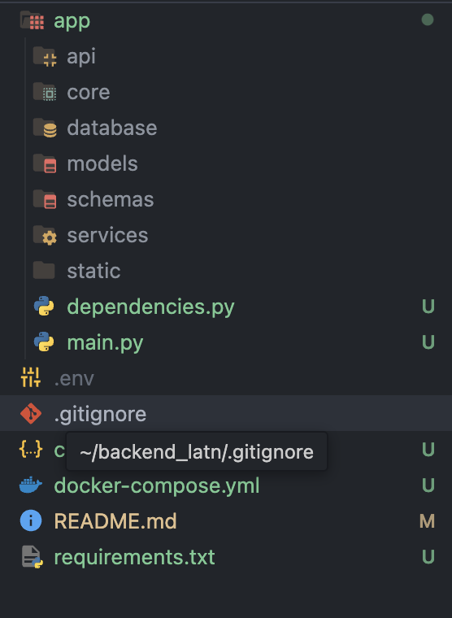

# 🏥 Hệ thống chẩn đoán bệnh bằng AI - Backend LATN  

## 📝 Giới thiệu  
Backend LATN là một hệ thống sử dụng AI để phân tích hình ảnh da, mô tả triệu chứng và dữ liệu âm thanh nhằm hỗ trợ chẩn đoán bệnh. Hệ thống bao gồm các bước xử lý ảnh, nhúng vector, tìm kiếm ngữ nghĩa và phản hồi thông tin chẩn đoán.  

## 🚀 Chức năng chính  
✅ Nhận ảnh từ người dùng (upload từ thư viện hoặc chụp ảnh trực tiếp)  
✅ Lưu ảnh trên **Google Cloud Storage**  
✅ Xử lý ảnh: giảm nhiễu, cân bằng histogram, phát hiện biên cạnh, phân đoạn ảnh  
✅ Nhúng ảnh thành vector bằng mô hình **CLIP**  
✅ Tìm kiếm ảnh tương tự bằng **FAISS**  
✅ Xử lý dữ liệu âm thanh và văn bản liên quan  

## 🛠 Công nghệ sử dụng  
- **FastAPI**: Framework backend chính  
- **Google Cloud Storage**: Lưu trữ ảnh  
- **OpenCV + Sharp**: Tiền xử lý ảnh  
- **CLIP**: Nhúng ảnh thành vector  
- **FAISS**: Tìm kiếm ảnh dựa trên vector  
- **Google Cloud Storage**: Lưu vector vào FAISS Index + Google Cloud Storage 

## 📂 Cấu trúc thư mục 

---

## ⚙️ Cài đặt và chạy server  

### 1️⃣ Cài đặt thủ công  
```bash
# Clone repo
git clone https://github.com/ThuPham60232004/backend_latn.git
cd backend_latn

# Cài đặt dependencies
pip install -r requirements.txt

# Chạy server FastAPI
uvicorn main:app --host 0.0.0.0 --port 8000 --reload
```

### 2️⃣ Chạy với Docker  
```bash
# Build image
docker build -t backend-latn .

# Chạy container
docker run -d -p 8000:8000 --name backend-latn backend-latn
```

---


## 💡 Đóng góp & Phát triển  
- Pull request được chào đón.  
- Nếu bạn muốn đóng góp, hãy tạo issue trên GitHub.  
